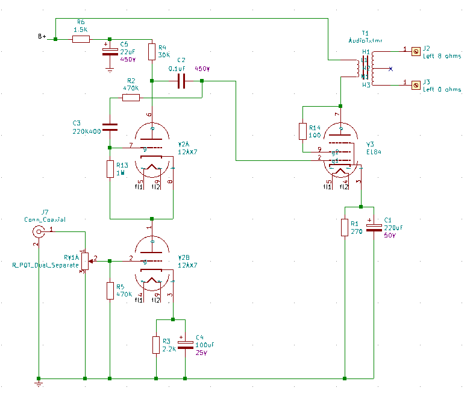

# Nobsound EL84 Amplifier

This is the updated schematic of the (formerly 6P1) amplifier.

These are likely to change as I continue to hack it up and "improve" it.

## First Wave Enhancemnts

The objective here:

* To replace the 6H8C preamp tube per channel with a 12AX7 tube per channel.
* To replace the pair of 6P1 tubes per channel with a single EL84 tube per channel.
* The rectifier with regular diodes.

By 2020-07-29 I was able meet my original objectives. And to do so without purchasing any electronic components or tubes. Which for me and my projects is highly unusual. And now I have a special sense of smug-ness as well.

I orginally went with a 12AT7 tubes. As they have less gain then the 12AX7 tubes. But I found the sound to be crackly and brittle. I tried to replace the coupling capacitor (which is likely a 0.022uF capacitor) with a 0.1uF capacitor. This gives it a bit more bass response. But still not very good. I guess there is that problem were the 12AT7 is generally considered to be not musical at all. I ended up putting some old Mullard 12AX7 tubes I had in my junk drawer. They have "Holland" printed on them. And even do a really nice vintage filament flash when turning on. But they are really crisp and awesome sounding. Using old tubes (likely liberated from my Traynor amp) onto here is like a fine bottle of wine with peanut butter toast. But you only live once, so might as well enjoy the stuff I have rather than hoarding it forever and not using it.

### Amplifier channel schematic

### Power supply schematic

### Updated component list

We added the following parts (to the original schematic)

| Part | Value | Description |
|:--|:--|:--|
| V1 |  | (Removed) |
| V2 | 12AX7 | Left channel preamp tube |
| V3 | EL84 | Left channel power tube |
| V4 | | (Removed) |
| V5 | 12AX7 | Right channel preamp tube |
| V6 | EL84 | Right channel power tube |
| V7 |  | (Removed) |
| C2 | 0.1uF; 450V | (Updated from original schematic) |
| C10 | 0.1uF; 450V | (Updated from original schematic) |
| D5 | 1N4005 | Rectifier board |
| D6 | 1N4005 | Rectifier board |
| D7 | 1N4005 | Rectifier board |
| D8 | 1N4005 | Rectifier board |
| C17 | 47nF; 450V | Rectifier board |
| C18 | 47nF; 450V | Rectifier board |
| C19 | 47NF; 450V | Rectifier board |
| C20 | 47nF; 450V | Rectifier board |
| R21 | 220K; 2 watts | (bleeder resistor I added after C7) |

## Second Wave Enhancements

Some small updates.

## Ideas for future enhancements

* Add balanced input channels (needs an op-amp) and TRS connector to convert from the balanced output from my mixer into the single unbalanced into the L/R channels.
* Integrate the bluetooth receiver I have on my desk into the amp. Use the LED for connected to override the input selection, so that the input goes to the output from the bluetooth receiver. Some kind of reed relay here then.