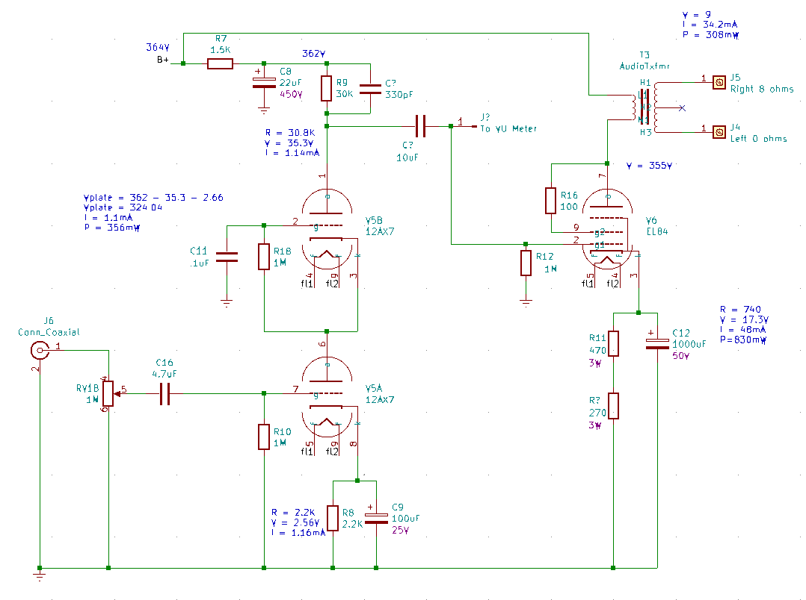

# Nobsound EL84 Amplifier

This is the updated schematic of the (formerly 6P1) amplifier.

These are likely to change as I continue to hack it up and "improve" it.

## First Wave Enhancemnts

The objective here:

* To replace the 6H8C preamp tube per channel with a 12AX7 tube per channel.
* To replace the pair of 6P1 tubes per channel with a single EL84 tube per channel.
* The rectifier with regular diodes.

### EL84 Power Tubes

So based on the calculations (in the circuit analysis), to use an EL84, I would want the current through the cathode resistor to be about 40mA.  The resistor is 270 ohms, so I am looking for a voltage drop of about V=I*R or 0.04*270 or about 10V.

In practise plugging in an EL84 and testing it out I see it stabilized around 11.75V. Or about 43mA. This is perfect and exactly where we would like it to be.

Reading on https://www.18watt.com/viewtopic.php?t=12875 , the values we have is the values we should use. Ok then.

Wire in the amp and do a test. Well. it seems to work. Let’s do the right channel.
It sounds ok.

I keep reading and finding schematics where the screen resistor should go to the B+, not the output transformer the plate goes to. This amp seems to be wired incorrectly then?

Experiment to wire these to the B+. I only have the 100 ohm screen bypass resistors. I think it should be 1K.
But when I do this, a terrible hum sound and buzzing. Ok, put that back. It might be the hum was because the resistor was 10x too low from what is recommended in this configuration? This is something I would like to understand later.

### Conclusions

By 2020-07-29 I was able meet my original objectives. And to do so without purchasing any electronic components or tubes. Which for me and my projects is highly unusual. And now I have a special sense of smug-ness as well.

I orginally went with a 12AT7 tubes. As they have less gain then the 12AX7 tubes. But I found the sound to be crackly and brittle. I tried to replace the coupling capacitor (which is likely a 0.022uF capacitor) with a 0.1uF capacitor. This gives it a bit more bass response. But still not very good. I guess there is that problem were the 12AT7 is generally considered to be not musical at all. I ended up putting some old Mullard 12AX7 tubes I had in my junk drawer. They have "Holland" printed on them. And even do a really nice vintage filament flash when turning on. But they are really crisp and awesome sounding. Using old tubes (likely liberated from my Traynor amp) onto here is like a fine bottle of wine with peanut butter toast. But you only live once, so might as well enjoy the stuff I have rather than hoarding it forever and not using it.

### Amplifier channel schematic

>R2 and C3 are incorrect here, these go to ground, and are not a feedback as indicated. I later discovered this while updating the schematic on 2020-08-31 for v2.3 revision.

### Power supply schematic

### Updated component list

We added the following parts (to the original schematic)

| Part | Value | Description |
|:--|:--|:--|
| V1 |  | (Removed) |
| V2 | 12AX7 | Left channel preamp tube |
| V3 | EL84 | Left channel power tube |
| V4 | | (Removed) |
| V5 | 12AX7 | Right channel preamp tube |
| V6 | EL84 | Right channel power tube |
| V7 |  | (Removed) |
| C2 | 0.1uF; 450V | (Updated from original schematic) |
| C10 | 0.1uF; 450V | (Updated from original schematic) |
| D5 | 1N4005 | Rectifier board |
| D6 | 1N4005 | Rectifier board |
| D7 | 1N4005 | Rectifier board |
| D8 | 1N4005 | Rectifier board |
| C17 | 47nF; 450V | Rectifier board |
| C18 | 47nF; 450V | Rectifier board |
| C19 | 47NF; 450V | Rectifier board |
| C20 | 47nF; 450V | Rectifier board |
| R21 | 220K; 2 watts | (bleeder resistor I added after C7) |

## Second Wave Enhancements

Some small updates.

* Replaced the electrolytic capacitors with United Chemicon branded capacitors. I have anxiety these capacitors are going to be the cheapest, poorest quality, Chinese made capacitors. Same voltage rating and values (except noted below).

| Part | Value | Old Brand | Notes |
|:-----|:------|:----------|:------|
| C1   | 220uF | Samyoung  | This is now a 1000uF |
| C4   | 100uF | Samyoung  | |
| C5   | 22uF  | Samyoung  | |
| C6   | 150uF | Philips   | |
| C7   | 150uF | Philips   | |
| C8   | 22uF  | Samyoung  | |
| C9   | 100uF | Samyoung  | |
| C12  | 220uF | Samyoung  | This is now a 1000uF |

If they are even the brands they say they are. They could very well be counterfit even.

All I see in the forums is "Replace all Philips caps!!!".

Samyoung is a Korean brand, also known for their terrible quality and reliability.

* Changed the values of the EL84 cathode bypass capacitor from 220uF to 1000uF This is beacuse I have been reading larger capacitor values here help with improving lower frequency responses.
  * https://el34world.com/Forum/index.php?topic=9452.0

I would like to find a more technical calculation for this. So far the sounds do not sound bad. But I can not tell if or how much added bass response I actually have here. I still need to get around to doing a frequency response analysis of this amp.

* Replaced the charred looking 270 ohm resistors with new 270 ohm resistors. Though I ordered 3W kind, I think the old ones may have been 5W. Doh. Well. From the measured voltage and and computed current across this resistor, the power is only about 0.5watts. Though that was idle. I guess we should try to measure the voltage under full load somehow.  For now I will use them and if they burn up, I will replace them with higher power resistors.

## Third Wave Enhancements

The volume knob was all scratchy. I guess the cheap Chinese crap knob that was used just wore out. Funny because I barely even use this knob. And lately I still experience slight imbalance in volume from left to right side. This likely has to do with my room geometry. I would like to have separate volumes for left and right channels.

So had the idea to remove the VU meters (Since those are basically cheap Chinese crap as well and they do not really work for me. They barely deflect on all volumes and I basically never look at them on the amp. So in place of the VU meters to put a potentiometer for the volume control.
I cut a piece of 24ga aluminum I had handy and screwed it inside the chassis using the hardware for the VU meters. Then mounted two 1M pots. The same kind I used in my Traynor amp. They feel very satisfying to touch and turn. Using plastic knobs like I always have used on my amp and before on guitar. They are not ideal but do match the color scheme of black and silver.

I noticed after there was slight buzz on the left channel. Replace the preamp tube. That makde a big difference. I guess the old Holland tube I was using is finally done. Wish I had a kind of tester for tubes. It seems a lot of the way I approach tubes is magic, finding a specific tube works in a specific slot on a chassis.

## 2020-08-31 (v2.3)

* Replace the EL84 cathode bypass resistor (R1, R11) from 270 to 470 ohms. I think it was running a bit too hot before.
* Notice there is no input capacitor to decouple the DC coming in. This is fucking why I get terrible hum when connecting to my Rolls MiniMix and computer audio. Install 0.047uF capacitor in series with inputs.
* Notice there is not Grid stopper resistor into the first stage of the 12AX7 tubes (V2, V5). Install a 4.7K grid stop resistor following the newly added input decoupling capacitor.
* Replace the 12AX7 input grid leak resistor (R5, R10) from 470K to 1M resistor. I think larger value will work better with the newly added decoupling capacitor and grid stopper resistor.
* Notice I had the A/B elements for V2, V5 switched in the schematic from how it is. Update the schematic.
* I had made an error in schematic before, The (C3, C11) actually go to ground, not feedback from 12AX7 output. And (R2, R12) is actually a grid leak resistor for th EL84. Ok. good. I was just about to add one of those.
* There is no grid stopper resistor between preamp output after the capacitor and the EL84. Add a 5.6K resistor.
* Change the EL34 grid leak resistors (R2, R12) from 470K to 1M
* Nicely mount the diode rectifier circuit board onto the inside side of the chassis with standoffs and screws. Before I had this just dangling loose and covered with a piece of tape.

This all came about as I was trying to attach one of those VFD spectum analyzers. It needs 5VDC. I have a 7805 type regulator. Make a rectifier and filter cap and circuit board to connect to the unused 5VAC fillament supply. I see 5V when I test it. And measure 4.9V on the VFD.  Maybe for some reason the VFD requires more current than the regulator IC can supply. I will investigate later.

For now I am excited that these small tunings will make the amp sound a bit less "shrill". It felt there was a bit too much presence or high end sometimes, especially with sounds of people talking.

Since there was no input capacitor, I bet that is why we were having shitty noise when connecting this to the mixer. And why I went on that foxhole to get the Art clean pro. Try to connect the amp directly to the mixer now. Heh. no noise. When crank it up there is the usual high pitch buzz. But that is always there on high gain settings. The hum sound is gone. So I can put away the clean pro box. One less part, and three less cables, on the desk.

## 2020-09-01

Come back to revisit the VFD spectrometer upgrade.

Connect the power supply module I made to a lab power supply. At first I had fun experience of having to whack the power supply to make it work. Cheap Chinese crap strikes again. But it seems the 7805 (or switching regulator version of the one I have) needs at least 9V input to make it turn on. With the loading effect of the VFD anyway.  So with the 5VAC filament this was enough to give me a 5V regulated output on open circuit. But under load this was not enough input voltage.
The total current draw seems to be  about 260mA at 10V input. or 2.6W.

I have one of these small DC-DC converters that takes in 4-9V and then puts out 5V. so let's try this. Hm. The module I have is only 2 watts. That is going to push this pretty hard. Maybe let it run on my desk a bit to see if it burns up after a bit.

It seems to work when I power it off the 5V supply as a clock. But once it starts to work as a display for audio it cuts out and reboots. This means likely that the 5V supply from the transformer can not source enough current here. Try to switch my power supply module to use one of the filament supplies. Ok. that seems to work, and not hose the amp. I bet this is somehow a weak ass counterfit transformer. Maybe I am used to Traynor transformers.

Have the idea to replace the 12AX7 sockets with shielded sockets. I didn't really have a problem with noise. But mounting the VFD spectrograph meter on the chassis in front of the tubes, it is likely I would now be picking up stray  noise from this thing. You can hear the switch supply on it even. The shielded sockets I have are not very good. But they were a lot better than the likely counterfit sockets that were on the chassis. They just fall apart as you take them off.

The VCD appears to work. I mounted it to the chassis with some furniture brackets I had and sheet metal screws. Drill hole to put wires into the chassis. The power supply is inside on the side of the chassis on stand offs. When there is no sound playing there are no bars stuck on a little bit (like I had when I connected this to the output of my computer audio interface, or mixer headphones before). So this allows the clock to turn on. For a while I have been just using this as a clock.

## 2020-09-06

I felt lately the nobsound sounded like i "had a blanket over the speakers". Craking up the master level on the Rolls mixer seems to do less effect than it used to.

Adding that 5.6 k resistor between the preamp and poweramp stages I think. And I don't really need the 4.7K on the input either.

* Go delete R15, R17, R19, R20.

## 2020-10-07 (v2.4)

Replace the 0.22uF capacitor with some not-counterfeit capacitors.  I only had 0.1uF, so putting two of these in parallel.

I think the EL84s are still running a bit too hot.

Also the right and left channels have slightly different volumes for the same knob position.

Measure voltages and resistances. Compute currents.

Experiment with different cathode load resistors for the EL84. I find a 1.2K resistor gives us a good 84% plate dissipation (according to https://robrobinette.com/Tube_Bias_Calculator.htm )

Experiment with a constant current source using transistors. I can only get up to about 40mA on this. I think the voltage drop through the transistors with the high impedance here is losing some of the current?

Experiment with different resistors.

Max cathode current is [65mA](https://en.wikipedia.org/wiki/EL84).

I am getting about 68 to 70mA right now with just the 470 ohm resistor in there.

Find that when I put in the 270 ohm resistor I used to have in there, in series with the 470 ohm (so 740 ohms total) I am able to get about 50mA cathode current.

I like the idea of tinkering with current sources, but to add all this stuff and an adjustment knob when just 2 resistors will work well enough seems silly.

I would use a single resistor. But these are what I have in stock at the moment.

So updating both channels with this series resistor. I now am using about 40-60mA less from the power supply. I think it is no longer doing that high pitch whine from the transformer like it would before. Just the noise from the inverter in the VFD module now.

Put the amp back together for now.

Nope.

It felt a little too much high end now. It is good that it feels more sparkly. Likely less loading the power suppy it is able to do higher frequencies. But it is too bright for my tastes.

* Replace the input bypass capacitors from 0.047uF to 4.7uF. I used SMD ceramics soldered to pin headers, soldered to the wire. Awesome hack.
* Replaced the 2x 0.1uF coupling capacitor between preamp and power amp with a 10uF 250V. its probably fine.
* Added a 330pF 400V bypass cap onto the plate of the preamp. Hoping this helps tame the higher frequencies a bit.

Ok. back together now it sounds better bass response and less of that too much fizzy it was.

## 2021-04-25 (v2.5)

I replaced the EL84 tubes with some new Tungsol tubes. But now I was getting arcing when the tubes were cold.

* Add a soft standby switch - A RC time delay, Schmitt trigger to drive a MOSFET to engage the high voltage to the tubes after they had time to warm up.
* A buffer circuit to drive the VFD to remove some annoying audio bleedover.

I was still getting tube arcing though. These were new tubes. Try some other tubes. Nope still getting arcing.

Measure the voltage across teh tubes. It is way too high. around 390.

Also measure the voltage across the filaments. It is about 6.9V. This is also too high, more than 10% out of spec.

Rip apart the entire amplifier out of anger. The main power transformer is just "too hot".

Discover the filament lines were center tapped. Oh. So that is why I have not been able to add rectifiers to this. Makes sense now. I was fighting the ground reference there in the transformer.  Fucking hell.

Also pissed off at these shit ceramic tube sockets. I think these things are cracking my tubes and causing them to be dead after resocketing them a couple times, as I do for testing. I lost 2 new preamp tubes recently for no reason.

## 2021-05-15

* Order new Belton tube sockets. Install them onto chassis.
* Disconnect the ground reference on the filament windings.
* Use one filament winding to power the bridge rectifier and 5V regulators I have in there for the 5V things, like the display, the soft start circuit, the buffer for the display.
* Experiment with using a full bridge rectifier and [these](https://www.monolithicpower.com/en/mp2307.html) regulators I got from Aliexpress. They say rated up to 3A. I have about 2.34A measured here. Let's try these out.
Build a full bridge rectifier using [SDURD840](https://www.digikey.ca/en/products/detail/smc-diode-solutions/SDURD840TR/6022668) diodes. It is what I had handy.
* In actuality, I am only able to deliver about 4v at 0.5A to the tubes from this regulator module. The load of only 1 tube flattens out its output voltage. This is not anywhere near its rated 3A capacity. I guess this is exactly what I should expect from something I get off Aliexpress, where it is made entirely from counterfeit parts from China.
* Try another [random](https://datasheetgo.com/xl6009e1-datasheet-regulator/) Aliexpress buck converter module I have. This one sais "up to 4A" - Also fail. It can't even drive one tube. There is either some silly short circuit protection here, that these topologies of converters can't power tube filaments. Or these are just crap modules.

