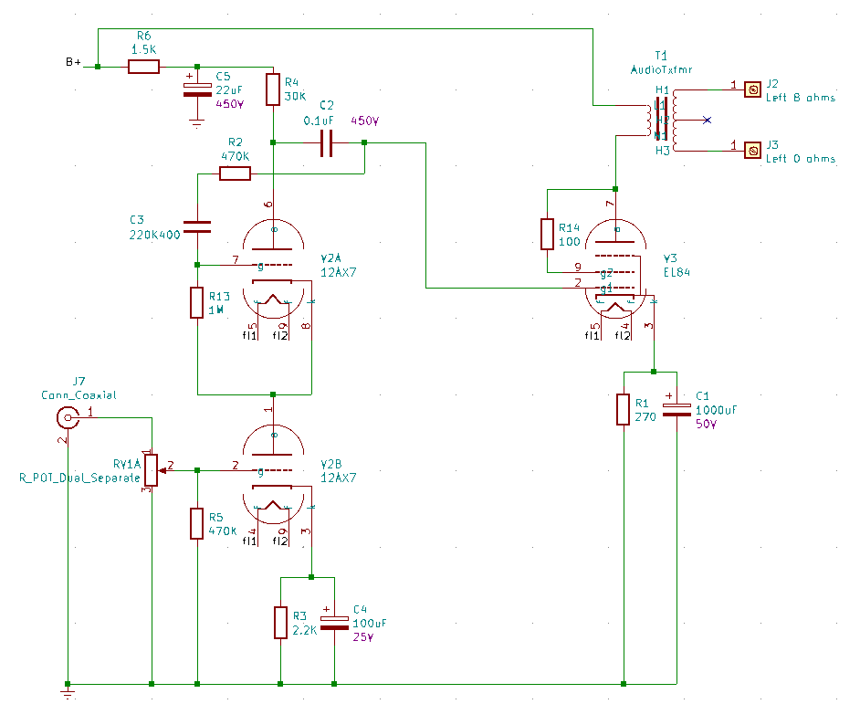

# Nobsound EL84 Amplifier

This is the updated schematic of the (formerly 6P1) amplifier.

These are likely to change as I continue to hack it up and "improve" it.

## First Wave Enhancemnts

The objective here:

* To replace the 6H8C preamp tube per channel with a 12AX7 tube per channel.
* To replace the pair of 6P1 tubes per channel with a single EL84 tube per channel.
* The rectifier with regular diodes.

### EL84 Power Tubes

So based on the calculations (in the circuit analysis), to use an EL84, I would want the current through the cathode resistor to be about 40mA.  The resistor is 270 ohms, so I am looking for a voltage drop of about V=I*R or 0.04*270 or about 10V.

In practise plugging in an EL84 and testing it out I see it stabilized around 11.75V. Or about 43mA. This is perfect and exactly where we would like it to be.

Reading on https://www.18watt.com/viewtopic.php?t=12875 , the values we have is the values we should use. Ok then.

Wire in the amp and do a test. Well. it seems to work. Let’s do the right channel.
It sounds ok.

I keep reading and finding schematics where the screen resistor should go to the B+, not the output transformer the plate goes to. This amp seems to be wired incorrectly then?

Experiment to wire these to the B+. I only have the 100 ohm screen bypass resistors. I think it should be 1K.
But when I do this, a terrible hum sound and buzzing. Ok, put that back. It might be the hum was because the resistor was 10x too low from what is recommended in this configuration? This is something I would like to understand later.

### Conclusions

By 2020-07-29 I was able meet my original objectives. And to do so without purchasing any electronic components or tubes. Which for me and my projects is highly unusual. And now I have a special sense of smug-ness as well.

I orginally went with a 12AT7 tubes. As they have less gain then the 12AX7 tubes. But I found the sound to be crackly and brittle. I tried to replace the coupling capacitor (which is likely a 0.022uF capacitor) with a 0.1uF capacitor. This gives it a bit more bass response. But still not very good. I guess there is that problem were the 12AT7 is generally considered to be not musical at all. I ended up putting some old Mullard 12AX7 tubes I had in my junk drawer. They have "Holland" printed on them. And even do a really nice vintage filament flash when turning on. But they are really crisp and awesome sounding. Using old tubes (likely liberated from my Traynor amp) onto here is like a fine bottle of wine with peanut butter toast. But you only live once, so might as well enjoy the stuff I have rather than hoarding it forever and not using it.

### Amplifier channel schematic

### Power supply schematic

### Updated component list

We added the following parts (to the original schematic)

| Part | Value | Description |
|:--|:--|:--|
| V1 |  | (Removed) |
| V2 | 12AX7 | Left channel preamp tube |
| V3 | EL84 | Left channel power tube |
| V4 | | (Removed) |
| V5 | 12AX7 | Right channel preamp tube |
| V6 | EL84 | Right channel power tube |
| V7 |  | (Removed) |
| C2 | 0.1uF; 450V | (Updated from original schematic) |
| C10 | 0.1uF; 450V | (Updated from original schematic) |
| D5 | 1N4005 | Rectifier board |
| D6 | 1N4005 | Rectifier board |
| D7 | 1N4005 | Rectifier board |
| D8 | 1N4005 | Rectifier board |
| C17 | 47nF; 450V | Rectifier board |
| C18 | 47nF; 450V | Rectifier board |
| C19 | 47NF; 450V | Rectifier board |
| C20 | 47nF; 450V | Rectifier board |
| R21 | 220K; 2 watts | (bleeder resistor I added after C7) |

## Second Wave Enhancements

Some small updates.

* Replaced the electrolytic capacitors with United Chemicon branded capacitors. I have anxiety these capacitors are going to be the cheapest, poorest quality, Chinese made capacitors. Same voltage rating and values (except noted below).

| Part | Value | Old Brand | Notes |
|:-----|:------|:----------|:------|
| C1   | 220uF | Samyoung  | This is now a 1000uF |
| C4   | 100uF | Samyoung  | |
| C5   | 22uF  | Samyoung  | |
| C6   | 150uF | Philips   | |
| C7   | 150uF | Philips   | |
| C8   | 22uF  | Samyoung  | |
| C9   | 100uF | Samyoung  | |
| C12  | 220uF | Samyoung  | This is now a 1000uF |

If they are even the brands they say they are. They could very well be counterfit even.

All I see in the forums is "Replace all Philips caps!!!".

Samyoung is a Korean brand, also known for their terrible quality and reliability.

* Changed the values of the EL84 cathode bypass capacitor from 220uF to 1000uF This is beacuse I have been reading larger capacitor values here help with improving lower frequency responses.
  * https://el34world.com/Forum/index.php?topic=9452.0

I would like to find a more technical calculation for this. So far the sounds do not sound bad. But I can not tell if or how much added bass response I actually have here. I still need to get around to doing a frequency response analysis of this amp.

* Replaced the charred looking 270 ohm resistors with new 270 ohm resistors. Though I ordered 3W kind, I think the old ones may have been 5W. Doh. Well. From the measured voltage and and computed current across this resistor, the power is only about 0.5watts. Though that was idle. I guess we should try to measure the voltage under full load somehow.  For now I will use them and if they burn up, I will replace them with higher power resistors.

## Ideas for future enhancements

* Add balanced input channels (needs an op-amp) and TRS connector to convert from the balanced output from my mixer into the single unbalanced into the L/R channels.
* Integrate the bluetooth receiver I have on my desk into the amp. Use the LED for connected to override the input selection, so that the input goes to the output from the bluetooth receiver. Some kind of reed relay here then.
* Add a headphone jack. When a 6.35mm stereo plug is attached to the front, it will cut out the speaker outputs from the back. The trick is to balance the loading so the volume of the headphones is about the same as that on the speakers. Also my bose qc25 headphones have a high impedance, around 300 ohms. Need to figure out that first. Also I kind of don't want a cord going over to the amp. It would be awkward as the amp is out of the way.